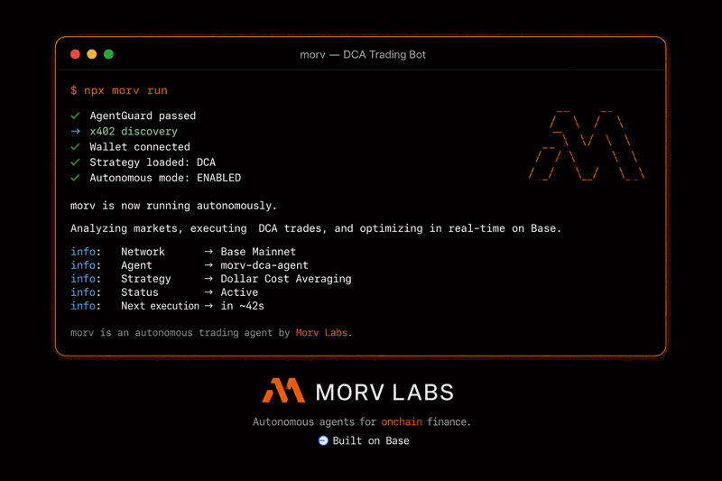

# Morv


-0052FF)


<div align="center">
  
  <br /><br />
  
  <br /><br />
  <a href="https://morv.run"><strong>morv.run</strong></a>
  &nbsp;·&nbsp;
  <a href="https://x.com/morvlabs">@morvlabs</a>
  &nbsp;·&nbsp;
  <a href="https://www.npmjs.com/package/@morv-labs/morv">npm</a>
</div>

<br />

**Onchain agent runtime for Base.**

*Code agents that move money.*

Morv is not another chat wrapper. Open **SDK + CLI** that runs the full agent loop — **BYOM models**, **MCP tools**, **x402 pay-per-request**, and **AgentGuard spend limits** — so agents call APIs and settle **USDC on Base** without draining wallets.

## Open source vs hosted

| **This repo (MIT)** | **[morv.run](https://morv.run) hosted** |
|---------------------|------------------------------------------|
| `@morv-labs/morv` SDK + `morv` CLI | Agent console, credits, billing |
| AgentGuard engine (local) | MCP gateway routing + marketplace |
| Wallet from your env keys | Optional — connect via `MORV_API_KEY` |

Build locally, ship to production, or plug into the hosted gateway — same SDK.

```bash
npm install @morv-labs/morv
npx morv init
npx morv agent create dca-bot --tools base-x402-discovery --daily 200 --per-tx 50
npx morv run "Scan Base pools and DCA $50 if ETH dips 3%"
```

**AI agents:** [QUICKSTART.md](QUICKSTART.md) (5 min) · [AGENTS.md](AGENTS.md) (full context) · [docs/ARCHITECTURE.md](docs/ARCHITECTURE.md)

**Primary users:** builders shipping onchain agents. Humans configure policy; agents execute within guardrails.

**Thesis:** agents need wallets + tool access + spend limits — not governance theater.

**Security:** [SECURITY.md](SECURITY.md)

---

## Live on Base

| Resource | Value |
|----------|-------|
| **Chain** | Base mainnet (8453) |
| **USDC** | `0x833589fCD6eDb6E08f4c7C32D4f71b54bdA02913` (6 decimals) |
| **SDK** | [`@morv-labs/morv`](https://www.npmjs.com/package/@morv-labs/morv) on npm |
| **App** | [morv.run](https://morv.run) — hosted console + MCP gateway |
| **Status** | SDK v0.1 · MIT · active development |

---

## Using this README as agent context

When working in Morv:

1. Read [AGENTS.md](AGENTS.md) for env vars, tool IDs, and onboarding order.
2. Read **System overview** and **End-to-end flows** for behavior.
3. Use **Onchain reference** for USDC on Base.
4. Use **Documentation map** to drill into specs — prefer linked paths over guessing.
5. Do not commit secrets (`.env`, keys).

---

## System overview

Morv is an onchain agent runtime — five layers for production agent workflows:

| Layer | Module | Role |
|-------|--------|------|
| **Security** | `AgentGuard` | Spending limits, allow/deny lists, anomaly checks, auto-pause |
| **Execution** | `McpRegistry` / `McpGateway` | Install and run MCP tools |
| **Payment** | `X402Client` | HTTP 402 pay-per-request on Base |
| **Models** | `createModelRunner` | BYOM — OpenAI, Anthropic, Gemini, Groq, Ollama |
| **Chain** | `BaseWallet` / Bankr | USDC settlement on Base |

```
┌─────────────────────────────────────────────────────────────────┐
│ Layer 4 — Agent runtime (BYOM → tool selection → response)       │
├─────────────────────────────────────────────────────────────────┤
│ Layer 3 — AgentGuard (policy on every payment path)              │
├─────────────────────────────────────────────────────────────────┤
│ Layer 2 — MCP Gateway (install · quote · execute tools)          │
├─────────────────────────────────────────────────────────────────┤
│ Layer 1 — x402 Client (402 → pay → retry with proof)             │
├─────────────────────────────────────────────────────────────────┤
│ Layer 0 — Base (8453) USDC settlement                            │
└─────────────────────────────────────────────────────────────────┘
```

Full architecture: [docs/ARCHITECTURE.md](docs/ARCHITECTURE.md)

---

## What people build

| Pattern | Example prompt |
|---------|----------------|
| **DCA trading bot** | `Scan Base and DCA $50 if ETH dips 3%` |
| **x402 data aggregator** | `Aggregate DeFi TVL from six x402 APIs` |
| **Research agent** | `Summarize Base agent ecosystem this week` |
| **Multi-agent swarm** | `Researcher finds yield, trader allocates $80` |
| **Token launch flow** | `Deploy on Base and route fees to treasury` |

---

## End-to-end flows

### A. Agent bootstrap

| Step | Command | Result |
|------|---------|--------|
| Install | `npm install @morv-labs/morv` | SDK + types |
| Init | `npx morv init` | Local config + `agent.morv.ts` |
| Create | `npx morv agent create dca-bot --daily 200 --per-tx 50` | Agent + AgentGuard policy |
| Tools | `npx morv add base-x402-discovery` | MCP tool registered |
| Run | `npx morv run "Scan Base pools and DCA"` | BYOM + tools + guard |

### B. x402 pay-per-request

| Step | Behavior |
|------|----------|
| Request | Agent calls paid API → receives HTTP 402 |
| Guard | AgentGuard validates amount against policy |
| Pay | Wallet sends USDC on Base (or Bankr rail) |
| Retry | Request retried with payment proof header |

Set `X402_PROVIDER=bankr` (default) or `morv`.

### C. MCP tool execution

| Step | Behavior |
|------|----------|
| Quote | Gateway returns tool price |
| Guard | Policy check before deduct |
| Execute | Tool runs, result returned to model |
| Ledger | Usage recorded for audit |

### D. Policy enforcement

| Check | Example |
|-------|---------|
| Per-tx limit | Block $500 payment when cap is $50 |
| Daily budget | Pause agent at $200/day |
| Anomaly | Velocity spike → auto-pause |
| Allow/deny | Whitelist treasury addresses |

---

## TypeScript SDK surface

| Path | Purpose |
|------|---------|
| `MorvClient` | Agent lifecycle, register, run |
| `AgentGuard` | Standalone policy engine on any payment path |
| `McpRegistry` | Local tool catalog |
| `McpGateway` | Remote marketplace routing |
| `X402Client` | HTTP 402 payment flow |
| `createPlatformWalletFromEnv` | Bankr or Base wallet from env |
| `createModelRunner` | BYOM model adapter |

CLI commands: `init` · `register` · `agent create` · `add` · `run` · `guard status` · `tools list`

---

## Quick start (TypeScript)

```typescript
import { MorvClient, createPlatformWalletFromEnv } from '@morv-labs/morv';

const wallet = createPlatformWalletFromEnv();
const morv = new MorvClient();

const agent = await morv.createAgent(
  {
    id: 'dca-bot',
    model: { provider: 'openai', model: 'gpt-4o-mini', apiKey: process.env.OPENAI_API_KEY! },
    policy: { dailyLimitUsd: 200, perTxLimitUsd: 50, autoPause: true },
    tools: ['base-x402-discovery', 'base-web-scraper'],
  },
  wallet
);

const answer = await agent.run('Scan Base yield pools and DCA $50 if dip detected');
console.log(answer);
```

Optional gateway at [morv.run](https://morv.run):

```typescript
const morv = new MorvClient({
  apiBaseUrl: 'https://api.morv.run',
  apiKey: process.env.MORV_API_KEY,
});
```

---

## Onchain reference

| Constant | Value |
|----------|-------|
| Chain ID | 8453 (Base) |
| USDC | `0x833589fCD6eDb6E08f4c7C32D4f71b54bdA02913` |
| Decimals | 6 |
| Default RPC | `https://mainnet.base.org` |

---

## Environment

| Variable | Purpose |
|----------|---------|
| `OPENAI_API_KEY` | BYOM provider |
| `GROQ_API_KEY` | Groq (free tier friendly) |
| `MORV_WALLET_PRIVATE_KEY` | Direct Base USDC wallet |
| `BANKR_API_KEY` | Bankr wallet on Base |
| `BANKR_AGENT_ADDRESS` | Bankr agent address |
| `X402_PROVIDER` | `bankr` (default) or `morv` |
| `MORV_API_BASE_URL` | Optional gateway |
| `MORV_API_KEY` | Optional account key |

Copy [`.env.example`](.env.example).

---

## Documentation map

| Document | Topic |
|----------|-------|
| [QUICKSTART.md](QUICKSTART.md) | 5-minute agent setup |
| [AGENTS.md](AGENTS.md) | AI agent entry — env, tools, flows |
| [docs/ARCHITECTURE.md](docs/ARCHITECTURE.md) | Layer design, modules |
| [docs/DEPLOY.md](docs/DEPLOY.md) | Build, test, npm publish |
| [SECURITY.md](SECURITY.md) | Reporting, operator checklist |
| [CHANGELOG.md](CHANGELOG.md) | Version history |

---

## Repository layout

```
morv/
├── README.md              ← you are here
├── QUICKSTART.md          ← fast onboarding
├── AGENTS.md              ← AI agent context
├── SECURITY.md
├── CHANGELOG.md
├── index.html             ← GitHub Pages / morv.run
├── logo.jpg
├── og.png                 ← social preview (Twitter, GitHub)
├── morv-hero.gif          ← README hero animation
├── packages/
│   ├── sdk/               @morv-labs/morv
│   └── cli/               morv CLI
├── examples/
├── docs/
└── .github/workflows/     CI build + test
```

---

## Quick start (developers)

```bash
git clone https://github.com/Morv-Labs/morv.git
cd morv && npm install && npm run build && npm test
```

Windows PowerShell:

```powershell
cd morv; npm install; npm run build; npm test
```

---

## Design principles

- **Machine legibility** — agents and builders read code, not slide decks
- **Adversarial by default** — AgentGuard on every payment path
- **No vendor lock-in** — BYOM, forkable SDK, MIT license
- **Base-native** — USDC, x402, MCP ecosystem on chain 8453
- **Composable** — swap wallet, model, or tool without rewriting agent logic

---

## License

MIT — Morv SDK and CLI are public infrastructure.

[Morv Labs](https://github.com/Morv-Labs) · [morv.run](https://morv.run) · [@morvlabs](https://x.com/morvlabs)
