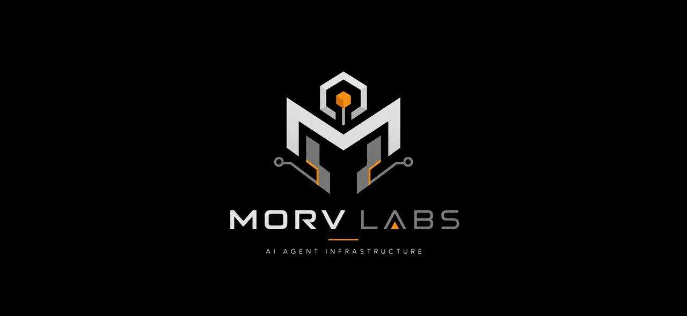

# Morv


-0052FF)


<div align="center">
  
  <br /><br />
  <a href="https://morv.run"><strong>morv.run</strong></a>
  &nbsp;·&nbsp;
  <a href="https://x.com/morvlabs">@morvlabs</a>
  &nbsp;·&nbsp;
  <a href="https://www.npmjs.com/package/@morv-labs/morv">npm</a>
</div>

<br />

**Infrastructure for autonomous AI agents on Base — MCP tools, x402 payments, and spending policy in one SDK.**

Morv is the operating layer agents use to discover tools, pay for APIs, and operate onchain — with guardrails built in.

```bash
npm install @morv-labs/morv
npx morv init
npx morv agent create dca-bot --tools base-x402-discovery --daily 200 --per-tx 50
npx morv run "Scan Base pools and DCA if ETH dips 3%"
```

---

## Quick start

```typescript
import { MorvClient, createPlatformWalletFromEnv } from '@morv-labs/morv';

const wallet = createPlatformWalletFromEnv();
const morv = new MorvClient();

const agent = await morv.createAgent(
  {
    id: 'dca-bot',
    model: { provider: 'openai', model: 'gpt-4o-mini', apiKey: process.env.OPENAI_API_KEY! },
    policy: { dailyLimitUsd: 200, perTxLimitUsd: 50, autoPause: true },
    tools: ['base-x402-discovery', 'base-web-scraper'],
  },
  wallet
);

const answer = await agent.run('Scan Base yield pools and DCA $50 if dip detected');
console.log(answer);
```

Optional gateway at [morv.run](https://morv.run):

```typescript
const morv = new MorvClient({
  apiBaseUrl: 'https://api.morv.run',
  apiKey: process.env.MORV_API_KEY,
});
```

---

## System overview

| Layer | Module | Role |
|-------|--------|------|
| **Security** | `AgentGuard` | Spending limits, allow/deny lists, anomaly checks, auto-pause |
| **Execution** | `McpRegistry` / `McpGateway` | Install and run MCP tools from registry or gateway |
| **Payment** | `X402Client` | HTTP 402 pay-per-request on Base |
| **Models** | `createModelRunner` | BYOM — OpenAI, Anthropic, Gemini, Groq, Ollama |
| **Chain** | `BaseWallet` | USDC settlement on Base mainnet |

```
┌─────────────────────────────────────────────────────────────┐
│  Agent (your app / CLI)                                      │
├─────────────────────────────────────────────────────────────┤
│  AgentGuard  →  policy check before every payment           │
├─────────────────────────────────────────────────────────────┤
│  MCP Gateway  →  tool install · quote · execute             │
├─────────────────────────────────────────────────────────────┤
│  x402 Client  →  discover · pay · retry with proof          │
├─────────────────────────────────────────────────────────────┤
│  Base (8453)  →  USDC · mainnet settlement                  │
└─────────────────────────────────────────────────────────────┘
```

Full details: [`docs/ARCHITECTURE.md`](docs/ARCHITECTURE.md)

---

## What people build

| Agent | Command |
|-------|---------|
| **DCA trading bot** | `morv run "DCA $50 ETH if 3% dip"` |
| **x402 data aggregator** | `morv run "Aggregate DeFi TVL from all x402 sources"` |
| **Research agent** | `morv run "Summarize Base ecosystem news this week"` |
| **Multi-agent swarm** | `morv swarm create --agents researcher,trader,guard` |

---

## CLI

```bash
npx morv init
npx morv agent create dca-bot --tools base-x402-discovery --daily 200 --per-tx 50
npx morv add base-web-scraper
npx morv run "Scan Base and execute DCA if conditions met"
npx morv guard status dca-bot
```

---

## Environment

| Variable | Description |
|----------|-------------|
| `OPENAI_API_KEY` | Model provider key (BYOM) |
| `MORV_WALLET_PRIVATE_KEY` | Agent wallet on Base (USDC) |
| `BANKR_API_KEY` | Alternative wallet via Bankr on Base |
| `BANKR_AGENT_ADDRESS` | Bankr agent address |
| `BASE_RPC_URL` | Default: `https://mainnet.base.org` |
| `X402_PROVIDER` | `bankr` (default) or `morv` |
| `MORV_API_BASE_URL` | Optional — gateway at [morv.run](https://morv.run) |
| `MORV_API_KEY` | Optional — from `morv register` |

USDC on Base: `0x833589fCD6eDb6E08f4c7C32D4f71b54bdA02913`

---

## Repository layout

```
morv/
├── packages/sdk/     @morv-labs/morv
├── packages/cli/     morv CLI
├── examples/
├── docs/
└── logo.jpg
```

---

## Examples

| File | Description |
|------|-------------|
| [`examples/basic-usage.ts`](examples/basic-usage.ts) | Minimal agent + AgentGuard |
| [`examples/base-mainnet.ts`](examples/base-mainnet.ts) | Base USDC payments |
| [`examples/full-platform.ts`](examples/full-platform.ts) | MCP + x402 + gateway |

---

## Documentation

- [Architecture](./docs/ARCHITECTURE.md)
- [Deploy & publish](./docs/DEPLOY.md)

---

## License

MIT — [Morv Labs](https://github.com/Morv-Labs)
